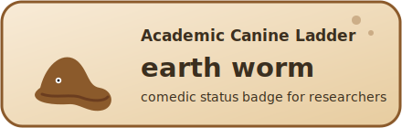
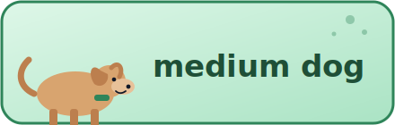
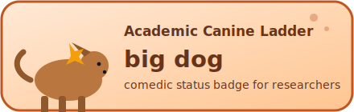
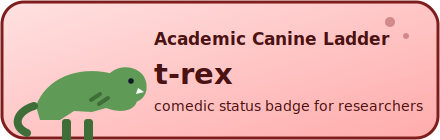

# Are you a big dog?

A light-hearted badge set for self-identifying your "academic food chain" level in READMEs, docs, and websites.

This project is intentionally comedic, I think. Low key it is real though. Use it to break the ice or just be proud ot be a big dog. FYI there are not that many t-rex's so chill.

## Levels (low to high)

1. earth worm
2. small dog
3. medium dog
4. big dog
5. t-rex

## Badge Options

You can choose both a **style** and a **format**.

- Styles:
  - `classic`: compact shields-like badge
  - `illustrated`: larger playful cartoon badge
- Formats:
  - `svg`: sharp at any size, recommended default
  - `png`: raster fallback

### Directory Layout

```text
badges/
  svg/
    classic/
    illustrated/
  png/
    classic/
    illustrated/
scripts/
  generate_badges.sh
  render_badges.sh
```

## Previews

### Classic Style

| Level | Preview |
| --- | --- |
| earth worm |  |
| small dog |  |
| medium dog |  |
| big dog |  |
| t-rex |  |

### Illustrated Style

| Level | Preview |
| --- | --- |
| earth worm |  |
| small dog |  |
| medium dog |  |
| big dog |  |
| t-rex |  |

## How To Use

### 1) Choose your file path

Pick one of these patterns:

- `badges/svg/classic/<level>.svg`
- `badges/svg/illustrated/<level>.svg`
- `badges/png/classic/<level>.png`
- `badges/png/illustrated/<level>.png`

where `<level>` is one of:

- `earth-worm`
- `small-dog`
- `medium-dog`
- `big-dog`
- `t-rex`

### 2) Markdown (README.md or other Markdown)

If the image is in the same repo:

```md

```

If the image is hosted in another repo (raw GitHub URL):

```md

```

Linked badge pattern:

```md
[](https://github.com/<OWNER>/<REPO>)
```

### 3) HTML (web pages, docs platforms that allow HTML)

```html
/<REPO>/<BRANCH>/badges/svg/illustrated/medium-dog.svg"
  alt="Academic level: medium dog"
  height="64"
/>
```

### 4) Other web material

Anywhere an image URL works, use the same raw URL pattern and choose style/format based on context:

- Small inline contexts: `classic`
- Hero/profile panels: `illustrated`
- Modern web/docs: `svg`
- Legacy/platform compatibility: `png`

## Regenerating Assets

If you edit or add levels:

```bash
./scripts/generate_badges.sh
./scripts/render_badges.sh
```

`generate_badges.sh` creates all SVG files.
`render_badges.sh` renders PNGs using the first available renderer (`magick`, `rsvg-convert`, `inkscape`, `sips`, or `qlmanage`).

## Accessibility Notes

- Always use descriptive alt text, for example: `Academic level: big dog`.
- Prefer SVG for crisp rendering and lower maintenance.

## License

Code and badge assets are available under the Apache 2.0 License in [LICENSE](LICENSE).
